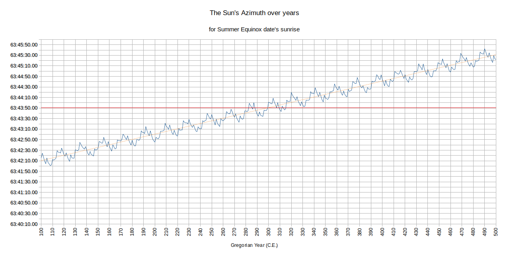

# Wobbling of the Earth
Study of wobbling motion of the earth
Program is a Python Script and can be run via terminal on Linux, Mac or Windows.
as follows:
```commandline
python3 we.py
```
When you run the program, it will first prompt you as follows:-
```commandline
WELCOME TO STUDY OF WOBBLING OF EARTH PROGRAM
=============================================
Please select event type you want to calculate wobbling for
a.) Summer Equinox
b.) Summer Solstice
c.) Winter Equinox
d.) Winter Solstice
x.) Exit

Please enter your choice as "A" to "E" or "X" to exit.

> 

```
Once you select your option and press enter, it shows you another prompt
```commandline
Please enter number of years for which calculation should be performed.
(If you do not enter anything, default calculation is for 500 years from the
starting year.)

> 

```
Then there is an option to select a year.
```commandline
Please enter year from which calculation should be started.
(NOTE :- If you do not enter anything, default year is 250 years in the past from
the date of current year.)
>
```
Then there is yet another demand to enter something. (Don't worry, this one is the last one!)

```commandline
Please select Sun related event for which calculation should be performed.
a.) Sunrise
b.) Sun at Meridian
c.) Sunset
d.) Sun at Anti-Meridian

(NOTE :-
1. If you do not enter anything, default event for which calculation will
    be done is Sunrise.
2. All events will be calculated for the selected place - i.e. Ahmedabad
)

> 
```
Now it will generate a CSV file within "output" folder with its name that preserves the choices entered at the prompts.
some [Sample data](docs/generated_data.csv) is here if you would like to have a look, and a graph created using such 
a sample data looks like following image:-

